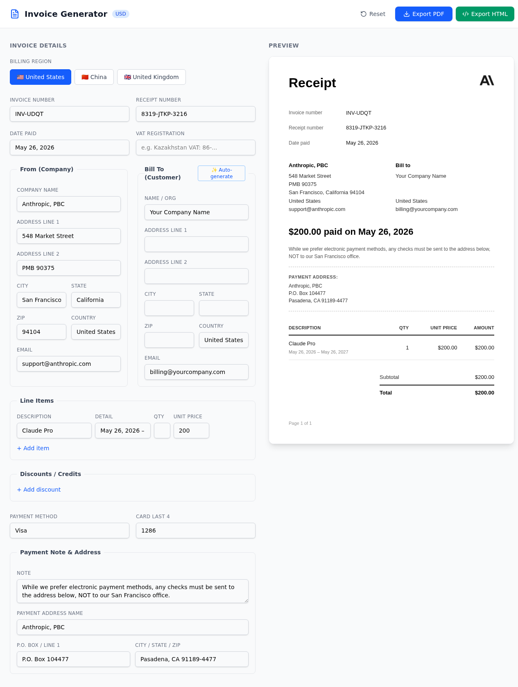

# claude-invoice

A production-ready invoice generator web app with Anthropic-style receipt template. Built with React + TypeScript + Vite. Supports multi-region billing (USA, China, UK), auto-generated fake billing addresses, PDF/HTML export, and live preview.



## Features

- Anthropic-style receipt template — matches the real Anthropic billing format
- Multi-region billing — switch between USA (USD), China (CNY), and UK (GBP) with one click
- Auto-generate billing address — random fake names, addresses, postal codes per region
- Auto-generate VAT/EIN/Tax ID — region-specific tax identifiers (EIN for US, VAT for UK, Tax ID for CN)
- Live preview — form changes reflect instantly on the receipt
- PDF export — html2canvas + jsPDF, fits single A4 page
- HTML export — standalone HTML with embedded base64 icon, no external dependencies
- Dynamic line items — add/remove items, quantities, discounts
- Payment address section — region-specific P.O. Box and payment notes

## Quickstart

```bash
# 1. Clone & enter
git clone https://github.com/exd77/claude-invoice.git
cd claude-invoice

# 2. Install dependencies
npm install

# 3. Run dev server (port 3000)
npm run dev

# 4. Or build for production & serve (port 3001)
npm run build
npx serve dist -l 3001
```

Then open `http://localhost:3000` (dev) or `http://localhost:3001` (production).

No env vars needed. No backend. Fully client-side.

## How It Works

1. **Select billing region** — USA, China, or UK. Switches company address, currency, VAT format, and payment address automatically.
2. **Edit invoice fields** — Invoice number, receipt number, date, company info, bill-to details, line items, discounts, payment info.
3. **Auto-generate** — Click the "Auto-generate" button on Bill To to fill in random fictional customer data (name, address, city, state, zip, country) matching the selected region. VAT Registration also auto-fills.
4. **Preview** — Right panel shows a live Anthropic-style receipt. Changes reflect instantly.
5. **Export** — PDF (single A4 page) or HTML (standalone, base64-embedded icon).

## Supported Regions

| Region | Company | Currency | VAT Format | Payment Address |
|--------|---------|----------|------------|-----------------|
| USA | Anthropic, PBC | USD ($) | EIN ##-####### | P.O. Box, Pasadena CA |
| China | Beijing Zhipu Technology | CNY (¥) | Tax ID (18 digits) | P.O. Box, Beijing |
| UK | DeepMind Technologies | GBP (£) | VAT GB### #### ## | 6 Pancras Square, London |

## File Layout

```
claude-invoice/
├── src/
│   ├── App.tsx                # Main shell, PDF/HTML export
│   ├── InvoiceForm.tsx        # Left panel — editable form
│   ├── InvoicePreview.tsx     # Right panel — receipt preview
│   ├── html-export.ts         # Standalone HTML generation
│   ├── billing-generator.ts   # Fake address/VAT generator (US, CN, UK)
│   ├── data.ts                # Country presets, currency helpers
│   ├── types.ts               # TypeScript interfaces
│   ├── icon-base64.ts         # Embedded Anthropic icon (base64)
│   └── assets/
│       └── anthropic-icon.png # Source icon (300x300)
├── package.json
├── vite.config.ts
├── postcss.config.js
└── README.md
```

## Tech Stack

- React 18 + TypeScript
- Vite (dev server + build)
- Tailwind CSS v4
- html2canvas + jsPDF (PDF export)
- Lucide React (icons)

## Notes

- All generated billing data is fictional. Don't use for fraud or identity misuse.
- HTML export uses embedded base64 icon — works fully offline.
- PDF export fits content to single A4 page automatically.
- The receipt template is styled after Anthropic's real billing format (Anthropic, PBC — 548 Market Street, San Francisco).
